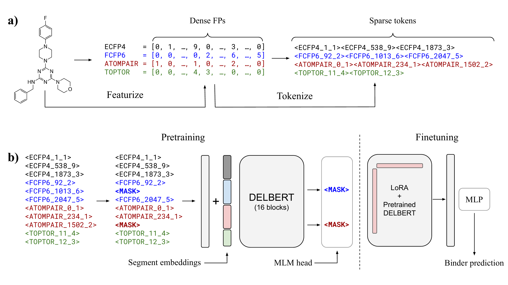

# DELBERT

**DELBERTL: Fingerprint Language Modeling for Generalizable Hit Discovery in DNA-Encoded Libraries**

[Paper](https://openreview.net/forum?id=wOOD4W3wJk) | [Data](https://huggingface.co/datasets/wanglab/delbert_data) | [Models](https://huggingface.co/wanglab/delbert-wdr91)

*Published at the [ICLR 2026 Workshop on Machine Learning for Genomics Explorations](https://mlgenx.github.io/)*

<p align="center">
  
</p>

## Overview

DELBERT is a self-supervised transformer encoder that treats molecular fingerprints (FPs) as a discrete token language, enabling masked language modeling (MLM) pretraining without requiring access to underlying chemical structures. This makes it uniquely suited for privacy-preserving settings such as the [AIRCHECK](https://aircheck.ai/datasets) initiative, where DEL screening data is released only as precomputed fingerprints. Under comprehensive library-based out-of-distribution (OOD) evaluation across four protein targets (WDR91, LRRK2, SETDB1, DCAF7), DELBERT significantly outperforms XGBoost and LightGBM ensemble baselines on three of four targets, with 1.6-2.7x improvements in early-enrichment metrics.

## Installation

```bash
git clone https://github.com/bowang-lab/DELBERT.git
cd DELBERT
```

**With conda:**
```bash
conda create -n delbert python=3.12 -y
conda activate delbert
pip install -e .
```

**With venv:**
```bash
python -m venv .venv
source .venv/bin/activate
pip install -e .
```

Optional dependencies:

```bash
pip install peft                # LoRA finetuning
pip install -e ".[baselines]"   # XGBoost, LightGBM baselines
pip install -e ".[all]"         # everything
```

## Inference

The fastest way to get predictions from a trained DELBERT model. See [`inference/inference_example.ipynb`](inference/inference_example.ipynb) for a complete walkthrough.

### Python API

```python
from inference.predict import predict

# Each molecule is a dict with 4 dense FP arrays (length 2048)
molecule = {
    "ECFP4": [...],    # int32 array, length 2048
    "FCFP6": [...],    # int32 array, length 2048
    "ATOMPAIR": [...], # int32 array, length 2048
    "TOPTOR": [...],   # int32 array, length 2048
}

probs = predict(molecule, model_path="wanglab/delbert-wdr91")
print(f"P(active): {probs[0]:.4f}")
```

### Batch inference from parquet

```python
from inference.predict import predict_from_parquet

result = predict_from_parquet(
    "path/to/molecules.parquet",
    model_path="wanglab/delbert-wdr91",
)
# Returns DataFrame with compound_id and probability columns
```

### CLI

```bash
python inference/predict.py \
    --model wanglab/delbert-wdr91 \
    --parquet path/to/molecules.parquet \
    --output predictions.csv
```

The input parquet must contain dense FP array columns: `ECFP4`, `FCFP6`, `ATOMPAIR`, `TOPTOR`. These are the same format as [AIRCHECK](https://aircheck.ai/datasets) parquet files. A small example file is included at [`data/WDR91_10-examples.parquet`](data/WDR91_10-examples.parquet).

## Data

**Tokenized datasets** (ready for model consumption) are hosted on HuggingFace: [wanglab/delbert_data](https://huggingface.co/datasets/wanglab/delbert_data)

Each dataset contains molecules represented as sparse molecular fingerprints (ECFP4, FCFP6, ATOMPAIR, TOPTOR) with binary enrichment labels from DEL screens against four protein targets: WDR91, LRRK2, SETDB1, and DCAF7.

**Raw parquet files** (dense FP arrays) can be downloaded from [AIRCHECK](https://aircheck.ai/datasets).

## Pretrained Models

Pretrained checkpoints are available on HuggingFace:

| Model | Target | HuggingFace |
|-------|--------|-------------|
| DELBERT-WDR91 | WDR91 | [wanglab/delbert-wdr91](https://huggingface.co/wanglab/delbert-wdr91) |

## Training

### 1. Prepare pretraining data

Tokenize molecular fingerprints into token sequences and build the vocabulary:

```bash
python scripts/prepare_pretrain_data.py --config-name pretrain/example
```

This creates `processed_data/pretrain/{experiment_id}/` with tokenized data and vocabulary.

### 2. Self-supervised pretraining (MLM)

Pretrain DELBERT via masked language modeling on all molecules (labels discarded):

```bash
python scripts/pretrain.py experiment=pretrain_example
```

### 3. Prepare supervised data

Prepare labeled data with library-based OOD splits:

```bash
python scripts/prepare_supervised_data.py --config-name supervised/example
```

### 4. Supervised finetuning

Finetune the pretrained model for binding prediction with LoRA:

```bash
python scripts/train_classifier.py experiment=classify_example \
    pretrained_checkpoint=outputs/pretrain_wdr91/.../checkpoints/best/epoch=XX-val_loss=X.XXX.ckpt
```

## Cross-Validation Evaluation

For rigorous OOD evaluation using library-based K-fold cross-validation:

**DELBERT transformer:**
```bash
python evals/library_cv/scripts/run_transformer_cv_orchestrator.py \
    --config evals/library_cv/configs/transformer_cv.yaml
```

**Baseline models (XGBoost, LightGBM):**
```bash
python evals/library_cv/scripts/run_baseline_cv.py \
    --config evals/library_cv/configs/baseline_cv.yaml
```

Both scripts use the same fold assignments for fair comparison. Results are saved to `evals/library_cv/results/`.

## Project Structure

```
DELBERT/
├── delbert/                  # Core package
│   ├── data/                 # Data loading, tokenization, splits
│   └── models/               # Model architecture, training modules
├── inference/                # Inference scripts and examples
│   ├── predict.py            # Prediction API (dict, parquet, CLI)
│   └── inference_example.ipynb
├── scripts/                  # Data prep and training entry points
├── evals/                    # Evaluation pipelines
│   └── library_cv/           # Library-based K-fold cross-validation
├── configs/                  # Hydra configuration files
├── data/                     # Example data files
├── assets/                   # Figures
├── pyproject.toml
└── requirements.txt
```

## Citation

```bibtex
@inproceedings{seyedahmadi2026delbert,
    title={{DELBERT}: Fingerprint Language Modeling for Generalizable Hit Discovery in {DNA}-Encoded Libraries},
    author={Arman Seyed-Ahmadi and Bing Hu and Armin Geraili and Anita Layton and Helen Chen and Shana O. Kelley and Bo Wang},
    booktitle={ICLR 2026 Workshop on Machine Learning for Genomics Explorations},
    year={2026},
    url={https://openreview.net/forum?id=wOOD4W3wJk}
}
```

## License

This project is licensed under the Apache License 2.0. See [LICENSE](LICENSE) for details.
